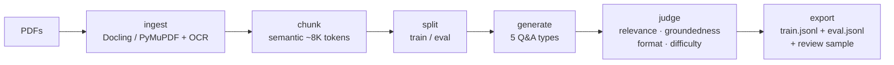

# synthetic-ds

[](https://www.python.org/)
[]()
[]()

Turn a folder of PDFs into a fine-tuning-ready Q&A dataset. Local, resumable, multi-provider.

```
pdfs/  →  train.jsonl  +  eval.jsonl  +  review_sample
```

## Install

```bash
git clone https://github.com/MauroProto/sintetic.git
cd sintetic
uv sync --extra parse --extra semantic
```

## Use

```bash
uv run synthetic-ds init
uv run synthetic-ds provider use fireworks
uv run synthetic-ds provider set-key fireworks
uv run synthetic-ds run ./pdfs
```

Output goes to `./pdfs/extraccion_dataset/`.

## How it works



Each phase checkpoints to disk. If a run dies, `--resume` picks up where it left off.

## Providers

OpenAI-compatible: `fireworks`, `openai`, `zai`, `groq`, `openrouter`, `xai`.

```bash
uv run synthetic-ds provider list
uv run synthetic-ds provider use openai
```

## CLI

| Command | What it does |
|---|---|
| `run <dir>` | Full pipeline, foreground |
| `submit <dir>` | Detached worker, returns `job_id` |
| `status / events / wait` | Check / stream / block on a job |
| `pause / resume / cancel` | Job controls |
| `doctor` | Health check |
| `app` | Local web UI on `:8787` |

Useful flags: `--json`, `--agent`, `--resume`, `--quality-preset {strict,balanced,permissive}`, `--max-pdfs N`.

Full reference: `uv run synthetic-ds --help`.

## Web app

```bash
cd src/synthetic_ds/web/frontend && pnpm install && pnpm build && cd -
uv run synthetic-ds app
```

Live progress, run history, Q&A browser, YAML editor.

## Agents

For non-interactive use (Claude Code, OpenClawd, etc.) see [AGENTS.md](AGENTS.md).

## Stack

Python 3.12 · FastAPI · Typer · Pydantic v2 · Docling · PyMuPDF · OpenAI SDK · React 18 · Vite · Tailwind · shadcn/ui.

## Dev

```bash
uv sync --extra parse --extra semantic --extra dev
uv run --extra dev pytest
```
