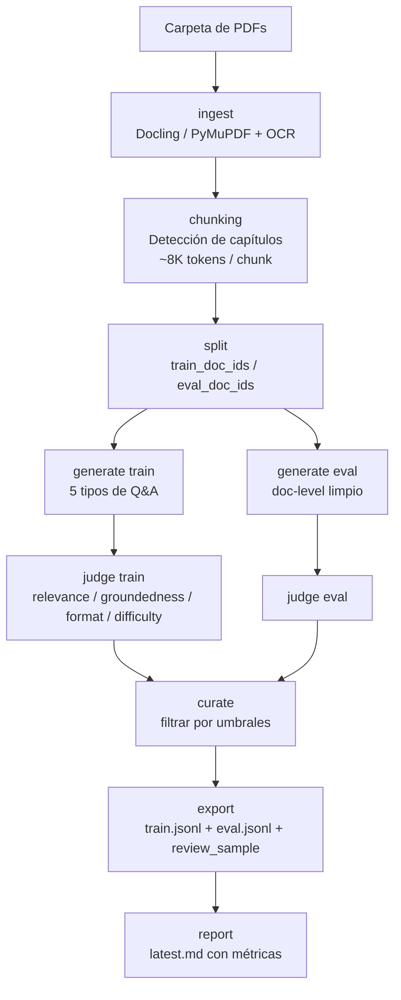

<div align="center">

# synthetic-ds

**Generador local de datasets sintéticos Q&A desde PDFs, con chunking semántico inteligente y soporte para múltiples proveedores OpenAI-compatibles.**

[](pyproject.toml)
[](https://www.python.org/)
[](https://fastapi.tiangolo.com/)
[](https://react.dev/)
[](https://typer.tiangolo.com/)
[](https://docs.pydantic.dev/)
[](https://docs.astral.sh/uv/)
[]()
[]()

</div>

---

`synthetic-ds` toma una carpeta de PDFs y produce un corpus listo para fine-tuning o evaluación: `train.jsonl` + `eval.jsonl` + un `review_sample` curado por un *judge* LLM. Todo corre **local**, las claves nunca salen de tu máquina, y la pipeline es **reanudable por fases** con checkpoints durables.

Para automatización con agentes externos (OpenClawd, Hermes, etc.), ver **[AGENTS.md](AGENTS.md)**.

---

## Tabla de contenidos

- [¿Por qué synthetic-ds?](#por-qué-synthetic-ds)
- [Características](#características)
- [Stack tecnológico](#stack-tecnológico)
- [Requisitos](#requisitos)
- [Instalación](#instalación)
- [Inicio rápido](#inicio-rápido)
- [Arquitectura del pipeline](#arquitectura-del-pipeline)
- [Chunking semántico inteligente](#chunking-semántico-inteligente)
- [Modos del dataset](#modos-del-dataset)
- [Tipos de preguntas generadas](#tipos-de-preguntas-generadas)
- [Referencia de CLI](#referencia-de-cli)
- [Configuración (`synthetic-ds.yaml`)](#configuración-synthetic-dsyaml)
- [Proveedores soportados](#proveedores-soportados)
- [App visual local](#app-visual-local)
- [Modo agente (no interactivo)](#modo-agente-no-interactivo)
- [Reanudación y checkpoints](#reanudación-y-checkpoints)
- [Calidad y judging](#calidad-y-judging)
- [Contrato de salida](#contrato-de-salida)
- [Seguridad de claves](#seguridad-de-claves)
- [Desarrollo](#desarrollo)
- [Estructura del repositorio](#estructura-del-repositorio)
- [Tests](#tests)
- [Roadmap](#roadmap)
- [Licencia](#licencia)

---

## ¿Por qué synthetic-ds?

Crear un dataset Q&A de calidad para fine-tuning suele requerir un pipeline frágil hecho a mano: parsear PDFs, cortarlos a la mitad, llamar a un modelo, validar respuestas, exportar JSONL. `synthetic-ds` empaqueta ese pipeline con decisiones opinionadas:

- **Local-first.** Nada de SaaS opaco: tus PDFs, tu corpus, tu cuenta del provider.
- **Chunks semánticos.** Detecta capítulos/secciones automáticamente y genera contexto rico (hasta 8K tokens por chunk) en lugar de cortar por cantidad fija de tokens.
- **Judging integrado.** Un LLM puntúa cada ejemplo (relevancia, *groundedness*, formato, dificultad, overall) y filtra por umbrales configurables.
- **Reanudable.** Si se cae la corrida en la fase 5/8, retomá desde el último checkpoint sin re-procesar lo anterior.
- **Multi-proveedor.** Cualquier endpoint OpenAI-compatible: Fireworks, OpenAI, Z.AI, Groq, OpenRouter, xAI. Cambiar de proveedor es una sola línea.
- **Apto para agentes.** Comandos JSON-only, jobs durables, *doctor* de diagnóstico, defaults conservadores con `--agent`.

---

## Características

| Bloque | Detalle |
|---|---|
| **Parsing** | Docling (primario, layout-aware) + PyMuPDF (fallback) + OCR vía Tesseract para PDFs escaneados. Detección automática de idioma, *math markers*, captura de páginas con contenido visual. |
| **Chunking** | Estrategia **semántica** (default): detecta jerarquía (capítulos/secciones/subsecciones) y arma chunks de ~8K tokens respetando estructura. Fallback `headings_first` para retrocompatibilidad. |
| **Generación** | 5 tipos de preguntas (extractiva, inferencial, *unanswerable*, multi-chunk, *format-specific*) con mezcla configurable. Resumen del documento + contexto previo/siguiente en cada prompt. |
| **Judging** | Score 0–1 en relevance / groundedness / format / difficulty / overall. Presets `strict` / `balanced` / `permissive` o umbrales custom. |
| **Exports** | `train.jsonl` (chat-format), `eval.jsonl` limpio por `doc_id`, `review_sample.jsonl` + `.csv` para auditoría humana, reporte `latest.md`. |
| **Job runner** | Submit detached, status, events, wait, pause, resume, cancel. Estado persistido en SQLite local (`~/.synthetic-ds/app.db`). |
| **Web UI** | React 18 + Vite + Tailwind + shadcn/ui. Server-Sent Events para progreso en vivo, dark mode persistente, editor Monaco para YAML. |
| **Multi-idioma** | Prompts en inglés con `language` forzado: 17 idiomas soportados (es/en/pt/fr/de/it/ca/nl/pl/ru/ja/ko/zh-cn/zh-tw/ar/hi/tr). |
| **Resiliencia** | Circuit breaker, OOM cooldown, *retries* con backoff vía Tenacity, checkpoints por fase. |

---

## Stack tecnológico

### Backend (Python ≥ 3.12)

| Paquete | Versión | Rol |
|---|---|---|
| [`fastapi`](https://github.com/tiangolo/fastapi) | `≥ 0.115.0` | API HTTP de la app local |
| [`uvicorn`](https://github.com/encode/uvicorn) | `≥ 0.30.6` | ASGI server |
| [`typer`](https://github.com/tiangolo/typer) | `≥ 0.12.5` | CLI declarativo |
| [`pydantic`](https://github.com/pydantic/pydantic) | `≥ 2.9.0` | Modelos y validación |
| [`openai`](https://github.com/openai/openai-python) | `≥ 1.99.0` | SDK OpenAI-compatible para todos los providers |
| [`pymupdf`](https://github.com/pymupdf/PyMuPDF) | `≥ 1.24.10` | Parser PDF rápido (fallback / `--parser-mode fast`) |
| [`docling`](https://github.com/DS4SD/docling) *(opcional)* | `≥ 2.45.0` | Parser PDF layout-aware (extra `parse`) |
| [`sentence-transformers`](https://github.com/UKPLab/sentence-transformers) *(opcional)* | `≥ 3.0.1` | Embeddings semánticos (extra `semantic`) |
| [`scikit-learn`](https://scikit-learn.org/) *(opcional)* | `≥ 1.5.1` | Clustering para chunking semántico |
| [`tiktoken`](https://github.com/openai/tiktoken) | `≥ 0.12.0` | Tokenización compatible con OpenAI |
| [`langdetect`](https://github.com/Mimino666/langdetect) | `≥ 1.0.9` | Detección automática de idioma |
| [`tenacity`](https://github.com/jd/tenacity) | `≥ 9.0.0` | Retries con backoff |
| [`keyring`](https://github.com/jaraco/keyring) | `≥ 25.6.0` | Almacenaje seguro de API keys |
| [`pyyaml`](https://github.com/yaml/pyyaml) | `≥ 6.0.2` | Config YAML |
| [`pillow`](https://python-pillow.org/) | `≥ 12.2.0` | Render de páginas para multimodal |

### Frontend (Node ≥ 18, pnpm)

| Paquete | Versión | Rol |
|---|---|---|
| [`react`](https://react.dev/) | `18.3.1` | UI |
| [`typescript`](https://www.typescriptlang.org/) | `5.5.4` | Tipos |
| [`vite`](https://vitejs.dev/) | `5.4.6` | Build / dev server |
| [`tailwindcss`](https://tailwindcss.com/) | `3.4.13` | Estilos utility-first |
| [`@radix-ui/*`](https://www.radix-ui.com/) | `1.x` | Primitives accesibles (shadcn/ui) |
| [`@tanstack/react-query`](https://tanstack.com/query) | `5.56.0` | Data fetching y cache |
| [`zustand`](https://github.com/pmndrs/zustand) | `4.5.5` | Estado global |
| [`framer-motion`](https://www.framer.com/motion/) | `11.5.4` | Animaciones |
| [`recharts`](https://recharts.org/) | `2.12.7` | Charts de métricas |
| [`@monaco-editor/react`](https://github.com/suren-atoyan/monaco-react) | `4.6.0` | Editor YAML embebido |
| [`react-router-dom`](https://reactrouter.com/) | `6.26.2` | Routing SPA |
| [`lucide-react`](https://lucide.dev/) | `0.445.0` | Iconos |

### Tooling

- [`uv`](https://docs.astral.sh/uv/) — gestor de dependencias y entornos Python.
- [`pnpm`](https://pnpm.io/) — gestor del frontend.
- [`pytest`](https://docs.pytest.org/) `≥ 8.3.2` — tests.
- [`tesseract`](https://github.com/tesseract-ocr/tesseract) — OCR (binario del sistema, opcional).

---

## Requisitos

| Requisito | Versión mínima | Notas |
|---|---|---|
| Python | `3.12` | Tipado moderno (PEP 695, `StrEnum`, etc.) |
| `uv` | última estable | `pip install uv` o `brew install uv` |
| Node.js | `18 LTS` | Solo si vas a usar la app web o desarrollar el frontend |
| `pnpm` | `9.x` | Idem |
| Tesseract | `5.x` *(opcional)* | Necesario solo para OCR de PDFs escaneados |
| API key | — | De cualquier proveedor OpenAI-compatible (ver [Proveedores](#proveedores-soportados)) |

Tesseract en macOS:
```bash
brew install tesseract tesseract-lang
```

Tesseract en Debian/Ubuntu:
```bash
sudo apt-get install -y tesseract-ocr tesseract-ocr-eng tesseract-ocr-spa
```

---

## Instalación

```bash
# Clonar
git clone https://github.com/MauroProto/sintetic.git
cd sintetic

# Sync con todos los extras (parser completo + chunking semántico + tests)
uv sync --extra parse --extra semantic --extra dev

# (Opcional) Build del frontend para usar la app web
cd src/synthetic_ds/web/frontend
pnpm install
pnpm build
cd -
```

Para una instalación mínima (solo CLI con PyMuPDF, sin Docling ni embeddings):

```bash
uv sync
```

---

## Inicio rápido

```bash
# 1. Inicializar el proyecto en el directorio actual
uv run synthetic-ds init --project-dir .

# 2. Elegir y configurar el proveedor
uv run synthetic-ds provider use fireworks
uv run synthetic-ds provider set-key fireworks   # se guarda en keychain del sistema

# 3. Diagnóstico previo (opcional pero recomendado)
uv run synthetic-ds doctor --project-dir .

# 4. Generar el dataset desde una carpeta de PDFs
uv run synthetic-ds run ./pdfs --resource-profile low
```

Salida esperada (estructura, ver [Contrato de salida](#contrato-de-salida)):

```text
./pdfs/extraccion_dataset/
├── train.jsonl
├── eval.jsonl
├── review_sample.jsonl
├── review_sample.csv
├── latest.md
└── .work/                # Estado interno reanudable (no editar)
```

---

## Arquitectura del pipeline



Cada flecha es una **fase** con checkpoint persistente en `.work/checkpoints/`. Si la corrida falla, `--resume` retoma desde la primera fase pendiente.

Fases canónicas (en orden):

```
ingest → split → generate_train → judge_train → generate_eval → judge_eval → export → report
```

---

## Chunking semántico inteligente

El sistema detecta **automáticamente** la estructura jerárquica del documento (capítulos, secciones, subsecciones) y arma chunks de ~8K–12K tokens que coinciden con unidades narrativas reales, en lugar de cortar a la mitad de un párrafo cada N tokens.

### Configuración

```yaml
# synthetic-ds.yaml
chunking:
  strategy: semantic          # "semantic" (recomendado) o "headings_first" (legacy)
  target_tokens: 8192         # ~capítulo completo
  overlap: 200                # Tokens de overlap entre chunks consecutivos
  max_pages_per_chunk: 25     # Guardia para PDFs/libros con poco texto por página
```

### Antes vs ahora

| Característica | Antes (`headings_first`) | Ahora (`semantic`) |
|---|---|---|
| Tamaño de chunk | 512 tokens (~1 página) | 8 192 tokens (~10–15 páginas) |
| Estrategia | Tokens fijos | Estructura semántica |
| Detección de capítulos | Solo secciones existentes | Automática con regex jerárquica |
| Contexto para *unanswerable* | Solo un fragmento | Documento completo |
| Overlap | 50 tokens | 200 tokens + resumen previo |

### Esquema mental

```
PDF (100 páginas)
   ↓ Detección automática
   ├── Capítulo 1: pp 1–25
   ├── Capítulo 2: pp 26–50
   └── …
   ↓
Chunks semánticos (~8K tokens cada uno)
   ↓
Cada llamada al LLM recibe:
  ├── DOCUMENT OVERVIEW (resumen global)
  ├── PREVIOUS CONTEXT (continuidad)
  └── CURRENT CHUNK (capítulo / sección completa)
```

Implementación: `src/synthetic_ds/semantic_chunking.py`.

---

## Modos del dataset

`synthetic-ds` detecta automáticamente el modo según la cantidad de PDFs:

| Modo | Trigger | Salida |
|---|---|---|
| **single_document** | 1 solo PDF | `train.jsonl` + `review_sample`. **Sin** eval limpio (no hay forma de hacer hold-out por documento). |
| **multi_document** | 2 o más PDFs | `train.jsonl` + `eval.jsonl` con split limpio por `doc_id` + `review_sample`. |

El modo se congela en `split.json` y se respeta en `--resume`. Los flags legacy `--generate-eval true/false` se ignoran cuando contradicen el modo detectado.

---

## Tipos de preguntas generadas

| Tipo | Descripción | Mezcla default |
|---|---|---|
| `extractive` | Respuesta literal (span) presente en el chunk | `35%` |
| `inferential` | Una sola inferencia sobre hechos del chunk | `25%` |
| `unanswerable` | Pregunta plausible cuya respuesta **no** está en el documento. Usada para entrenar refusal grounded. | `20%` |
| `multi_chunk` | Requiere combinar info de ≥ 2 chunks | `15%` |
| `format_specific` | Forza un formato (lista, tabla, JSON) | `5%` |

La mezcla es configurable en `generation.mix` y `unanswerable` usa visibilidad del documento completo para validar que la respuesta realmente no existe.

---

## Referencia de CLI

### Comandos principales

```bash
uv run synthetic-ds --help
```

| Comando | Descripción |
|---|---|
| `init` | Crea/upgrade `synthetic-ds.yaml` en `--project-dir`. |
| `ingest <pdf_dir>` | Solo parsea PDFs y arma chunks. |
| `split` | Congela `train_doc_ids` / `eval_doc_ids`. |
| `generate --split <train\|eval>` | Genera ejemplos para un split. |
| `curate --split <train\|eval>` | Pasa los ejemplos por el judge y filtra. |
| `export` | Escribe `train.jsonl` / `eval.jsonl` / `review_sample`. |
| `report` | Renderiza `latest.md` con métricas. |
| `run <pdf_dir>` | Pipeline end-to-end en foreground. |
| `submit <pdf_dir>` | Encola un job y arranca un worker desacoplado. |
| `jobs` | Lista jobs conocidos. |
| `status [--job-id]` | Estado actual de un job. |
| `events --job-id` | Journal de eventos del job. |
| `wait --job-id` | Bloquea hasta `completed` / `failed` / `cancelled`. |
| `pause / resume / cancel --job-id` | Controles seguros sobre un job. |
| `doctor` | Diagnóstico de dependencias, OCR, parser y provider key. |
| `verify --mode <mock-full\|real-smoke>` | Self-check. `mock-full` no consume créditos. |
| `app` | Lanza la web app local. |
| `provider list/use/set-key/test` | Gestión de proveedores y claves. |

### Flags transversales más útiles

| Flag | Propósito |
|---|---|
| `--project-dir <path>` | Directorio del proyecto (default `.`). |
| `--json` | Salida JSON parseable (todo el CLI lo soporta donde tiene sentido). |
| `--agent` | Defaults conservadores para ejecución no interactiva. |
| `--resource-profile <low\|balanced\|throughput>` | Preset de workers `(generation, judge)` = `(2,1)/(4,2)/(6,3)`. |
| `--generation-workers N` / `--judge-workers N` | Override manual. |
| `--parser-mode <auto\|fast\|ocr_safe>` | `fast` = solo PyMuPDF, sin OCR ni render de imágenes. |
| `--max-pdfs N` | Limita la cantidad de PDFs procesados de la carpeta ordenada. |
| `--max-pages-per-chunk N` | Evita chunks gigantes en libros con poco texto por página. |
| `--include-file <relative.pdf>` | Selecciona PDFs específicos (repetible). |
| `--quality-preset <strict\|balanced\|permissive>` | Preset de umbrales del judge. |
| `--min-overall-score 0.8` | Umbral overall custom (0–1). |
| `--min-groundedness-score 0.8` | Umbral groundedness custom (0–1). |
| `--allow-partial-export` | Exporta `train` aunque `eval` aún esté incompleto. |
| `--resume` | Salta fases que ya tienen checkpoint. |
| `--from-phase <ingest\|split\|generate_train\|judge_train\|generate_eval\|judge_eval\|export\|report>` | Fuerza re-empezar desde una fase. Acepta alias `generate` / `judge`. |
| `--only-train` / `--only-eval` | Limita la corrida a un split. |

### Ejemplo: corrida estricta para fine-tuning

```bash
uv run synthetic-ds run ./pdfs \
  --project-dir . \
  --parser-mode fast \
  --max-pdfs 20 \
  --max-pages-per-chunk 25 \
  --quality-preset strict \
  --min-overall-score 0.85 \
  --min-groundedness-score 0.85 \
  --json
```

### Ejemplo: reanudar tras un crash

```bash
uv run synthetic-ds run ./pdfs --project-dir . --resume --json
```

### Ejemplo: reconstruir solo eval

```bash
uv run synthetic-ds run ./pdfs \
  --project-dir . \
  --from-phase judge_eval \
  --only-eval \
  --allow-partial-export \
  --json
```

---

## Configuración (`synthetic-ds.yaml`)

`init` crea este archivo con defaults sensatos. Estructura completa:

```yaml
providers:
  active: fireworks
  profiles:
    fireworks:
      api_key_env: FIREWORKS_API_KEY
      base_url: https://api.fireworks.ai/inference/v1
      model: accounts/fireworks/routers/kimi-k2p5-turbo
      max_tokens: 2048
      temperature: 0.2
      concurrency: 4
    # openai, zai, groq, openrouter, xai...

parsing:
  primary_parser: docling          # docling | pymupdf
  fallback_parser: pymupdf
  default_language: es
  enable_ocr: true
  ocr_text_min_chars: 80           # Umbral para activar OCR por página
  render_page_images: true
  page_image_dpi: 144
  multimodal_max_pages_per_chunk: 2
  docling_max_pages: 100           # Salta a PyMuPDF en libros más grandes
  docling_max_ram_mb: 3072         # Salta a PyMuPDF si la RAM disponible es menor
  docling_streaming: true
  oom_cooldown_chunks: 5

chunking:
  strategy: semantic               # semantic | headings_first
  target_tokens: 8192
  overlap: 200
  max_pages_per_chunk: 25

generation:
  resource_profile: low            # low | balanced | throughput
  generation_workers: 2
  judge_workers: 1
  prompt_version: v1
  backend: sync_pool
  retries: 3
  max_generation_attempts_per_target: 3
  targets_per_chunk: 3
  page_batch_size: 100
  batch_pause_seconds: 2.0
  mix:
    extractive: 0.35
    inferential: 0.25
    unanswerable: 0.20
    multi_chunk: 0.15
    format_specific: 0.05
  refusal_text: "La informacion necesaria para responder esta pregunta no se encuentra en el documento provisto."

filters:
  preset: balanced                 # strict (0.85) | balanced (0.70) | permissive (0.55)
  groundedness_threshold: null     # Override del preset si != null
  overall_threshold: null

review:
  sample_size: 100

export:
  require_eval_split: true
  allow_partial_export: false
```

---

## Proveedores soportados

| Proveedor | Modelo default | Variable de entorno | Base URL |
|---|---|---|---|
| `fireworks` | `accounts/fireworks/routers/kimi-k2p5-turbo` | `FIREWORKS_API_KEY` | `api.fireworks.ai/inference/v1` |
| `openai` | `gpt-4.1-mini` | `OPENAI_API_KEY` | `api.openai.com/v1` |
| `zai` | `GLM-4.7` | `ZAI_API_KEY` | `api.z.ai/api/paas/v4` |
| `groq` | `moonshotai/kimi-k2-instruct-0905` | `GROQ_API_KEY` | `api.groq.com/openai/v1` |
| `openrouter` | `moonshotai/kimi-k2` | `OPENROUTER_API_KEY` | `openrouter.ai/api/v1` |
| `xai` | `grok-3-mini` | `XAI_API_KEY` | `api.x.ai/v1` |

Cualquiera de estos modelos puede sobrescribirse en `synthetic-ds.yaml`. El SDK usado es `openai>=1.99` y la pipeline asume **structured outputs** (JSON mode), así que el endpoint debe soportar `response_format` o `tool_choice` con JSON Schema.

```bash
uv run synthetic-ds provider list
uv run synthetic-ds provider use openai
uv run synthetic-ds provider test                # ping no destructivo
```

---

## App visual local

```bash
# Una sola vez: build del frontend (React + Vite)
cd src/synthetic_ds/web/frontend
pnpm install && pnpm build
cd -

# Lanzar la app
uv run synthetic-ds app --project-dir .
# → abre http://127.0.0.1:8787
```

La app permite:

- Elegir una carpeta con PDFs vía folder picker nativo.
- Iniciar/parar corridas y ver progreso en vivo (Server-Sent Events).
- Revisar corridas anteriores con métricas (distribución de tipos, scores, aceptación).
- Explorar los Q&A generados con filtros (por tipo, score, doc).
- Editar `synthetic-ds.yaml` desde un formulario o desde Monaco (YAML crudo).
- Dark mode por defecto, toggle persistente a light.

### Desarrollo del frontend (HMR)

```bash
# Terminal 1 — backend FastAPI
uv run synthetic-ds app --project-dir . --open-browser false

# Terminal 2 — Vite dev server
cd src/synthetic_ds/web/frontend
pnpm dev
# → http://127.0.0.1:5173 (proxea /api/* y /open/* al backend en :8787)
```

---

## Modo agente (no interactivo)

`synthetic-ds` está pensado para ser controlado por un agente externo. Recomendado: leer **[AGENTS.md](AGENTS.md)** completo.

```bash
# Setup totalmente no interactivo
export FIREWORKS_API_KEY=...
uv run synthetic-ds init --project-dir . --json
uv run synthetic-ds provider use fireworks --project-dir . --json
printf '%s\n' "$FIREWORKS_API_KEY" | uv run synthetic-ds provider set-key fireworks --stdin --json
uv run synthetic-ds doctor --project-dir . --json

# Job asíncrono con corpus estricto
JOB_ID=$(uv run synthetic-ds submit ./pdfs \
  --project-dir . \
  --parser-mode fast \
  --agent \
  --allow-partial-export \
  --max-pdfs 10 \
  --max-pages-per-chunk 25 \
  --quality-preset strict \
  --min-groundedness-score 0.8 \
  --min-overall-score 0.8 \
  --json | jq -r .job_id)

uv run synthetic-ds wait --job-id "$JOB_ID" --timeout-seconds 3600 --json
```

`submit` arranca un worker **desacoplado**: el proceso CLI puede salir y `status`/`events`/`wait` siguen funcionando contra el job store persistente.

---

## Reanudación y checkpoints

Cada fase escribe un checkpoint en:

```text
<pdf_dir>/extraccion_dataset/.work/checkpoints/<phase>.json
```

Comportamiento:

- `--resume`: salta cualquier fase con checkpoint. Útil tras un crash.
- `--from-phase <phase>`: recomienza desde esa fase, ignorando checkpoints posteriores.
- Sin flags: corre todas las fases de cero (sobrescribe artefactos).

Aliases aceptados:

- `--from-phase generate` → `generate_train` (o `generate_eval` si `--only-eval`).
- `--from-phase judge` → `judge_train` (o `judge_eval` si `--only-eval`).

---

## Calidad y judging

Cada ejemplo generado es evaluado por un *judge* LLM que devuelve un `JudgeScore`:

| Métrica | Descripción |
|---|---|
| `relevance` | Qué tan relevante es la pregunta para el documento. |
| `groundedness` | Si la respuesta está realmente apoyada por la evidencia. |
| `format` | Validez del formato pedido. |
| `difficulty` | Coherencia con la dificultad solicitada. |
| `overall` | Score final (0–1). |

### Presets

| Preset | groundedness | overall |
|---|---|---|
| `strict` | `0.85` | `0.85` |
| `balanced` *(default)* | `0.70` | `0.70` |
| `permissive` | `0.55` | `0.55` |

Override puntual:

```bash
uv run synthetic-ds run ./pdfs \
  --quality-preset balanced \
  --min-groundedness-score 0.80 \
  --min-overall-score 0.75
```

> ⚠️ `--min-overall-score 0.8` no garantiza que un modelo fine-tuned saque `0.8` en un benchmark externo. Garantiza que el export solo incluya ejemplos que el judge interno puntuó por encima de ese umbral.

---

## Contrato de salida

Todo el output visible queda en:

```text
<pdf_dir>/extraccion_dataset/
├── train.jsonl              # Chat-format: {"messages":[...], "metadata":{...}}
├── eval.jsonl               # Idem, split limpio por doc_id (multi-document)
├── review_sample.jsonl      # Sample para revisión humana (top-N por score)
├── review_sample.csv        # Idem, formato hoja de cálculo
├── latest.md                # Reporte con métricas y distribuciones
└── .work/                   # Estado interno reanudable (no editar)
    ├── documents.jsonl
    ├── chunks.jsonl
    ├── split.json
    ├── generated/
    ├── curated/
    └── checkpoints/
```

### Esquema de un registro `train.jsonl`

```json
{
  "messages": [
    {"role": "system", "content": "..."},
    {"role": "user", "content": "¿Cuál es la velocidad del sonido en aire seco a 20°C?"},
    {"role": "assistant", "content": "Aproximadamente 343 m/s."}
  ],
  "metadata": {
    "example_id": "ex-...",
    "source_doc": "fisica_general.pdf",
    "doc_id": "fisica-general-a1b2c3d4e5",
    "chunk_ids": ["chunk-..."],
    "page_range": [42, 47],
    "question_type": "extractive",
    "difficulty": "easy",
    "is_answerable": true,
    "teacher_model": "accounts/fireworks/routers/kimi-k2p5-turbo",
    "judge_model": "accounts/fireworks/routers/kimi-k2p5-turbo",
    "quality_score": 0.91,
    "split": "train",
    "prompt_version": "v1",
    "language": "es"
  }
}
```

---

## Seguridad de claves

`provider set-key <provider>` guarda la clave en el **keychain del sistema** vía [`keyring`](https://github.com/jaraco/keyring) cuando hay un backend disponible (Keychain en macOS, libsecret en Linux, Credential Manager en Windows).

Alternativas:

```bash
# Variable de entorno (preferida en CI / contenedores)
export FIREWORKS_API_KEY=fk-...

# Stdin sin interacción (preferida en agentes)
printf '%s\n' "$FIREWORKS_API_KEY" | \
  uv run synthetic-ds provider set-key fireworks --stdin
```

> El comando `--api-key fk-...` también existe pero **no es recomendado**: la clave queda en el history del shell.

---

## Desarrollo

```bash
# Setup completo
uv sync --extra parse --extra semantic --extra dev

# Tests
uv run --extra dev pytest

# Tests específicos
uv run --extra dev pytest tests/test_pipeline_session.py -v

# Frontend dev server con HMR
cd src/synthetic_ds/web/frontend
pnpm dev
```

### Verificación end-to-end sin gastar créditos

```bash
uv run synthetic-ds verify --mode mock-full     # backend mockeado
uv run synthetic-ds verify --mode real-smoke    # 1 llamada real al provider
```

---

## Estructura del repositorio

```text
.
├── src/synthetic_ds/
│   ├── cli.py                  # Typer CLI completo (1.1k LOC)
│   ├── pipeline.py             # PipelineSession (orquestador de fases)
│   ├── job_runner.py           # Job runner durable (submit/wait/cancel)
│   ├── ingest.py               # Parsing PDF + OCR + idioma
│   ├── chunking.py             # Estrategia legacy headings_first
│   ├── semantic_chunking.py    # Chunking semántico jerárquico (NEW)
│   ├── generate.py             # Targets, generación de Q&A
│   ├── curate.py               # Filtrado por umbrales del judge
│   ├── prompts.py              # Prompts multi-idioma
│   ├── exporter.py             # Export JSONL + review sample
│   ├── inference.py            # Backend OpenAI-compatible (sync pool)
│   ├── circuit.py              # Circuit breaker
│   ├── webapp.py               # FastAPI + SSE
│   ├── web/frontend/           # React 18 + Vite + Tailwind + shadcn/ui
│   ├── config.py               # Modelos Pydantic de config
│   ├── models.py               # Document/Chunk/Example/Judge/etc.
│   ├── storage.py              # JSONL + checkpoints + paths
│   ├── secrets.py              # Wrapper de keyring
│   ├── splitter.py             # Detección de modo y split por doc_id
│   ├── verify.py               # mock-full / real-smoke
│   └── ...
├── tests/                      # 30+ archivos pytest
├── synthetic-ds.yaml           # Config default
├── pyproject.toml              # Build + deps + extras
├── AGENTS.md                   # Runbook para agentes externos
└── README.md
```

---

## Tests

Tests cubren CLI, providers, ingest, chunking, generación, curation, export, jobs, web app, secrets y resume:

```bash
uv run --extra dev pytest                       # full suite
uv run --extra dev pytest -k cli                # solo CLI
uv run --extra dev pytest -k resume             # solo resume
uv run --extra dev pytest --tb=short            # tracebacks compactos
```

Listado abreviado:

```
test_cli.py                  test_cli_providers.py        test_app_cli.py
test_app_state.py            test_circuit_breaker.py      test_config_providers.py
test_curate.py               test_export.py               test_folder_picker.py
test_generate_types.py       test_generation_resume.py    test_generation_targets.py
test_inference.py            test_ingest.py               test_job_pool.py
test_job_runner.py           test_math_markers.py         test_multimodal_pipeline.py
test_pipeline_session.py     test_prompts.py              test_report.py
test_run_pipeline.py         test_secrets.py              test_split.py
test_storage.py              test_text_pipeline.py        test_verify.py
test_web_jobs.py             test_webapp_boot.py          test_webapp_static.py
```

---

## Roadmap

- [ ] Modo *streaming* en la generación para reducir picos de RAM.
- [ ] Adapter de Claude API nativo (además del modo OpenAI-compatible).
- [ ] Soporte oficial de batch APIs (OpenAI Batch, Anthropic Message Batches).
- [ ] Embeddings opcionales para deduplicación cruzada de Q&A.
- [ ] Dataset Cards auto-generadas (Hugging Face style).
- [ ] Plugin de export para LoRA/QLoRA frameworks (axolotl, unsloth).

¿Sugerencias? Abrí un issue.

---

## Licencia

Pendiente. Hasta que se publique un archivo `LICENSE`, asumí que el código es **propietario / todos los derechos reservados** y pedí permiso al autor antes de redistribuir.

---

<div align="center">

**[⬆ volver al inicio](#synthetic-ds)**

Hecho con `uv` + `typer` + `fastapi` + `react`.

</div>
