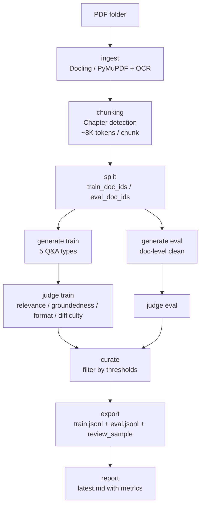

<div align="center">

# synthetic-ds

**Local-first synthetic Q&A dataset generator from PDFs — semantic chunking, LLM judging, multi-provider support.**

[](pyproject.toml)
[](https://www.python.org/)
[](https://fastapi.tiangolo.com/)
[](https://react.dev/)
[](https://typer.tiangolo.com/)
[](https://docs.pydantic.dev/)
[](https://docs.astral.sh/uv/)
[]()
[]()

</div>

---

`synthetic-ds` takes a folder of PDFs and produces a corpus ready for fine-tuning or evaluation: `train.jsonl` + `eval.jsonl` + a `review_sample` curated by an LLM *judge*. Everything runs **locally**, your API keys never leave your machine, and the pipeline is **resumable phase-by-phase** with durable checkpoints.

For automation by external agents (OpenClawd, Hermes, etc.), see **[AGENTS.md](AGENTS.md)**.

---

## Table of contents

- [Why synthetic-ds?](#why-synthetic-ds)
- [Features](#features)
- [Tech stack](#tech-stack)
- [Requirements](#requirements)
- [Installation](#installation)
- [Quick start](#quick-start)
- [Pipeline architecture](#pipeline-architecture)
- [Smart semantic chunking](#smart-semantic-chunking)
- [Dataset modes](#dataset-modes)
- [Question types](#question-types)
- [CLI reference](#cli-reference)
- [Configuration (`synthetic-ds.yaml`)](#configuration-synthetic-dsyaml)
- [Supported providers](#supported-providers)
- [Local web app](#local-web-app)
- [Agent mode (non-interactive)](#agent-mode-non-interactive)
- [Resume and checkpoints](#resume-and-checkpoints)
- [Quality and judging](#quality-and-judging)
- [Output contract](#output-contract)
- [API key security](#api-key-security)
- [Development](#development)
- [Repository layout](#repository-layout)
- [Tests](#tests)
- [Roadmap](#roadmap)
- [License](#license)

---

## Why synthetic-ds?

Building a high-quality Q&A dataset for fine-tuning usually means stitching together a fragile pipeline by hand: parse PDFs, slice them, call a model, validate answers, export JSONL. `synthetic-ds` packages that pipeline with opinionated defaults:

- **Local-first.** No opaque SaaS — your PDFs, your corpus, your provider account.
- **Semantic chunks.** Auto-detects chapters/sections and produces context-rich chunks (up to ~8K tokens) instead of fixed-size token cuts.
- **Built-in judging.** An LLM scores every example (relevance, groundedness, format, difficulty, overall) and filters by configurable thresholds.
- **Resumable.** If a run dies in phase 5/8, `--resume` picks up from the last checkpoint without re-processing earlier work.
- **Multi-provider.** Any OpenAI-compatible endpoint: Fireworks, OpenAI, Z.AI, Groq, OpenRouter, xAI. Switching providers is one line.
- **Agent-friendly.** JSON-only commands, durable jobs, a `doctor` health check, conservative defaults via `--agent`.

---

## Features

| Block | Detail |
|---|---|
| **Parsing** | Docling (primary, layout-aware) + PyMuPDF (fallback) + Tesseract OCR for scanned PDFs. Automatic language detection, math markers, image capture for visually rich pages. |
| **Chunking** | **Semantic** strategy by default: detects hierarchy (chapters / sections / subsections) and packs ~8K-token chunks that respect document structure. `headings_first` fallback for back-compat. |
| **Generation** | 5 question types (extractive, inferential, *unanswerable*, multi-chunk, format-specific) with a configurable mix. Each prompt includes a document summary plus previous/next-section context. |
| **Judging** | 0–1 scores for relevance / groundedness / format / difficulty / overall. Presets `strict` / `balanced` / `permissive` or custom thresholds. |
| **Exports** | `train.jsonl` (chat-format), `eval.jsonl` clean by `doc_id`, `review_sample.jsonl` + `.csv` for human audit, `latest.md` report. |
| **Job runner** | Detached submit, status, events, wait, pause, resume, cancel. State persisted to local SQLite (`~/.synthetic-ds/app.db`). |
| **Web UI** | React 18 + Vite + Tailwind + shadcn/ui. Server-Sent Events for live progress, persistent dark mode, embedded Monaco editor for YAML. |
| **Multi-language** | English-language prompts with forced output `language`: 17 languages supported (es/en/pt/fr/de/it/ca/nl/pl/ru/ja/ko/zh-cn/zh-tw/ar/hi/tr). |
| **Resilience** | Circuit breaker, OOM cooldown, retries with backoff via Tenacity, per-phase checkpoints. |

---

## Tech stack

### Backend (Python ≥ 3.12)

| Package | Version | Role |
|---|---|---|
| [`fastapi`](https://github.com/tiangolo/fastapi) | `≥ 0.115.0` | HTTP API for the local app |
| [`uvicorn`](https://github.com/encode/uvicorn) | `≥ 0.30.6` | ASGI server |
| [`typer`](https://github.com/tiangolo/typer) | `≥ 0.12.5` | Declarative CLI |
| [`pydantic`](https://github.com/pydantic/pydantic) | `≥ 2.9.0` | Models and validation |
| [`openai`](https://github.com/openai/openai-python) | `≥ 1.99.0` | OpenAI-compatible SDK used for every provider |
| [`pymupdf`](https://github.com/pymupdf/PyMuPDF) | `≥ 1.24.10` | Fast PDF parser (fallback / `--parser-mode fast`) |
| [`docling`](https://github.com/DS4SD/docling) *(optional)* | `≥ 2.45.0` | Layout-aware PDF parser (extra `parse`) |
| [`sentence-transformers`](https://github.com/UKPLab/sentence-transformers) *(optional)* | `≥ 3.0.1` | Semantic embeddings (extra `semantic`) |
| [`scikit-learn`](https://scikit-learn.org/) *(optional)* | `≥ 1.5.1` | Clustering for semantic chunking |
| [`tiktoken`](https://github.com/openai/tiktoken) | `≥ 0.12.0` | OpenAI-compatible tokenizer |
| [`langdetect`](https://github.com/Mimino666/langdetect) | `≥ 1.0.9` | Automatic language detection |
| [`tenacity`](https://github.com/jd/tenacity) | `≥ 9.0.0` | Retries with backoff |
| [`keyring`](https://github.com/jaraco/keyring) | `≥ 25.6.0` | Secure API-key storage |
| [`pyyaml`](https://github.com/yaml/pyyaml) | `≥ 6.0.2` | YAML config |
| [`pillow`](https://python-pillow.org/) | `≥ 12.2.0` | Page rendering for multimodal |

### Frontend (Node ≥ 18, pnpm)

| Package | Version | Role |
|---|---|---|
| [`react`](https://react.dev/) | `18.3.1` | UI |
| [`typescript`](https://www.typescriptlang.org/) | `5.5.4` | Types |
| [`vite`](https://vitejs.dev/) | `5.4.6` | Build / dev server |
| [`tailwindcss`](https://tailwindcss.com/) | `3.4.13` | Utility-first CSS |
| [`@radix-ui/*`](https://www.radix-ui.com/) | `1.x` | Accessible primitives (shadcn/ui) |
| [`@tanstack/react-query`](https://tanstack.com/query) | `5.56.0` | Data fetching & cache |
| [`zustand`](https://github.com/pmndrs/zustand) | `4.5.5` | Global state |
| [`framer-motion`](https://www.framer.com/motion/) | `11.5.4` | Animations |
| [`recharts`](https://recharts.org/) | `2.12.7` | Metrics charts |
| [`@monaco-editor/react`](https://github.com/suren-atoyan/monaco-react) | `4.6.0` | Embedded YAML editor |
| [`react-router-dom`](https://reactrouter.com/) | `6.26.2` | SPA routing |
| [`lucide-react`](https://lucide.dev/) | `0.445.0` | Icons |

### Tooling

- [`uv`](https://docs.astral.sh/uv/) — Python dependency / environment manager.
- [`pnpm`](https://pnpm.io/) — Frontend package manager.
- [`pytest`](https://docs.pytest.org/) `≥ 8.3.2` — tests.
- [`tesseract`](https://github.com/tesseract-ocr/tesseract) — OCR (system binary, optional).

---

## Requirements

| Requirement | Min version | Notes |
|---|---|---|
| Python | `3.12` | Modern typing (PEP 695, `StrEnum`, etc.) |
| `uv` | latest stable | `pip install uv` or `brew install uv` |
| Node.js | `18 LTS` | Only needed for the web app or frontend dev |
| `pnpm` | `9.x` | Same |
| Tesseract | `5.x` *(optional)* | Required only for OCR on scanned PDFs |
| API key | — | From any OpenAI-compatible provider (see [Providers](#supported-providers)) |

Tesseract on macOS:
```bash
brew install tesseract tesseract-lang
```

Tesseract on Debian/Ubuntu:
```bash
sudo apt-get install -y tesseract-ocr tesseract-ocr-eng tesseract-ocr-spa
```

---

## Installation

```bash
# Clone
git clone https://github.com/MauroProto/sintetic.git
cd sintetic

# Sync with all extras (full parser + semantic chunking + tests)
uv sync --extra parse --extra semantic --extra dev

# (Optional) Build the frontend if you plan to use the web app
cd src/synthetic_ds/web/frontend
pnpm install
pnpm build
cd -
```

Minimal install (CLI only with PyMuPDF, no Docling, no embeddings):

```bash
uv sync
```

---

## Quick start

```bash
# 1. Initialize the project in the current directory
uv run synthetic-ds init --project-dir .

# 2. Pick and configure the provider
uv run synthetic-ds provider use fireworks
uv run synthetic-ds provider set-key fireworks   # stored in the system keychain

# 3. Pre-flight diagnosis (optional but recommended)
uv run synthetic-ds doctor --project-dir .

# 4. Generate the dataset from a folder of PDFs
uv run synthetic-ds run ./pdfs --resource-profile low
```

Expected output (see [Output contract](#output-contract)):

```text
./pdfs/extraccion_dataset/
├── train.jsonl
├── eval.jsonl
├── review_sample.jsonl
├── review_sample.csv
├── latest.md
└── .work/                # Internal resumable state (do not edit)
```

---

## Pipeline architecture



Every arrow is a **phase** with a persistent checkpoint in `.work/checkpoints/`. If the run fails, `--resume` picks up from the first pending phase.

Canonical phase order:

```
ingest → split → generate_train → judge_train → generate_eval → judge_eval → export → report
```

---

## Smart semantic chunking

The system **automatically** detects the document's hierarchical structure (chapters, sections, subsections) and builds chunks of ~8K–12K tokens that match real narrative units, instead of slicing through paragraphs every N tokens.

### Configuration

```yaml
# synthetic-ds.yaml
chunking:
  strategy: semantic          # "semantic" (recommended) or "headings_first" (legacy)
  target_tokens: 8192         # ~one full chapter
  overlap: 200                # Tokens of overlap between consecutive chunks
  max_pages_per_chunk: 25     # Guardrail for sparse PDFs / books with thin pages
```

### Before vs now

| Aspect | Before (`headings_first`) | Now (`semantic`) |
|---|---|---|
| Chunk size | 512 tokens (~1 page) | 8 192 tokens (~10–15 pages) |
| Strategy | Fixed token count | Semantic structure |
| Chapter detection | Existing sections only | Auto-detected via hierarchical regex |
| Context for *unanswerable* | Single fragment | Full document |
| Overlap | 50 tokens | 200 tokens + previous summary |

### Mental model

```
PDF (100 pages)
   ↓ Auto-detection
   ├── Chapter 1: pp 1–25
   ├── Chapter 2: pp 26–50
   └── …
   ↓
Semantic chunks (~8K tokens each)
   ↓
Each LLM call receives:
  ├── DOCUMENT OVERVIEW (global summary)
  ├── PREVIOUS CONTEXT (continuity)
  └── CURRENT CHUNK (full chapter / section)
```

Implementation: `src/synthetic_ds/semantic_chunking.py`.

---

## Dataset modes

`synthetic-ds` automatically infers the mode based on PDF count:

| Mode | Trigger | Output |
|---|---|---|
| **single_document** | 1 PDF | `train.jsonl` + `review_sample`. **No** clean eval (you can't hold out a full document). |
| **multi_document** | 2+ PDFs | `train.jsonl` + `eval.jsonl` clean-split by `doc_id` + `review_sample`. |

The mode is frozen in `split.json` and respected by `--resume`. Legacy `--generate-eval true/false` flags are ignored when they contradict the inferred mode.

---

## Question types

| Type | Description | Default mix |
|---|---|---|
| `extractive` | Literal verbatim span answer present in the chunk | `35%` |
| `inferential` | Single inference step over facts in the chunk | `25%` |
| `unanswerable` | Plausible question whose answer is **not** in the document. Used to train grounded refusal. | `20%` |
| `multi_chunk` | Requires combining info from ≥ 2 chunks | `15%` |
| `format_specific` | Forces a specific format (list, table, JSON) | `5%` |

The mix is configurable via `generation.mix`. `unanswerable` items get full-document visibility so the model can verify the answer truly isn't there.

---

## CLI reference

### Top-level commands

```bash
uv run synthetic-ds --help
```

| Command | Description |
|---|---|
| `init` | Create / upgrade `synthetic-ds.yaml` in `--project-dir`. |
| `ingest <pdf_dir>` | Parse PDFs and build chunks. |
| `split` | Freeze `train_doc_ids` / `eval_doc_ids`. |
| `generate --split <train\|eval>` | Generate examples for a split. |
| `curate --split <train\|eval>` | Run the judge and filter. |
| `export` | Write `train.jsonl` / `eval.jsonl` / `review_sample`. |
| `report` | Render `latest.md` with metrics. |
| `run <pdf_dir>` | End-to-end pipeline in foreground. |
| `submit <pdf_dir>` | Enqueue a job and spawn a detached worker. |
| `jobs` | List known jobs. |
| `status [--job-id]` | Current state of a job. |
| `events --job-id` | Job event journal. |
| `wait --job-id` | Block until `completed` / `failed` / `cancelled`. |
| `pause / resume / cancel --job-id` | Safe job controls. |
| `doctor` | Dependency, OCR, parser and provider-key health check. |
| `verify --mode <mock-full\|real-smoke>` | Self-check. `mock-full` burns no credits. |
| `app` | Launch the local web app. |
| `provider list/use/set-key/test` | Provider and key management. |

### Most useful cross-cutting flags

| Flag | Purpose |
|---|---|
| `--project-dir <path>` | Project root (defaults to `.`). |
| `--json` | Parseable JSON output (supported wherever it makes sense). |
| `--agent` | Conservative defaults for non-interactive runs. |
| `--resource-profile <low\|balanced\|throughput>` | Worker preset `(generation, judge)` = `(2,1)/(4,2)/(6,3)`. |
| `--generation-workers N` / `--judge-workers N` | Manual override. |
| `--parser-mode <auto\|fast\|ocr_safe>` | `fast` = PyMuPDF only, no OCR, no image rendering. |
| `--max-pdfs N` | Cap how many PDFs from the (sorted) folder are processed. |
| `--max-pages-per-chunk N` | Avoid huge chunks on books with thin pages. |
| `--include-file <relative.pdf>` | Pick specific PDFs (repeatable). |
| `--quality-preset <strict\|balanced\|permissive>` | Judge threshold preset. |
| `--min-overall-score 0.8` | Custom overall threshold (0–1). |
| `--min-groundedness-score 0.8` | Custom groundedness threshold (0–1). |
| `--allow-partial-export` | Export `train` even if `eval` is incomplete. |
| `--resume` | Skip phases that already have a checkpoint. |
| `--from-phase <ingest\|split\|generate_train\|judge_train\|generate_eval\|judge_eval\|export\|report>` | Force re-running from a phase. Accepts `generate` / `judge` aliases. |
| `--only-train` / `--only-eval` | Restrict the run to a single split. |

### Example: strict run for fine-tuning

```bash
uv run synthetic-ds run ./pdfs \
  --project-dir . \
  --parser-mode fast \
  --max-pdfs 20 \
  --max-pages-per-chunk 25 \
  --quality-preset strict \
  --min-overall-score 0.85 \
  --min-groundedness-score 0.85 \
  --json
```

### Example: resume after a crash

```bash
uv run synthetic-ds run ./pdfs --project-dir . --resume --json
```

### Example: rebuild only eval

```bash
uv run synthetic-ds run ./pdfs \
  --project-dir . \
  --from-phase judge_eval \
  --only-eval \
  --allow-partial-export \
  --json
```

---

## Configuration (`synthetic-ds.yaml`)

`init` creates this file with sensible defaults. Full structure:

```yaml
providers:
  active: fireworks
  profiles:
    fireworks:
      api_key_env: FIREWORKS_API_KEY
      base_url: https://api.fireworks.ai/inference/v1
      model: accounts/fireworks/routers/kimi-k2p5-turbo
      max_tokens: 2048
      temperature: 0.2
      concurrency: 4
    # openai, zai, groq, openrouter, xai...

parsing:
  primary_parser: docling          # docling | pymupdf
  fallback_parser: pymupdf
  default_language: es
  enable_ocr: true
  ocr_text_min_chars: 80           # Per-page threshold to trigger OCR
  render_page_images: true
  page_image_dpi: 144
  multimodal_max_pages_per_chunk: 2
  docling_max_pages: 100           # Fall back to PyMuPDF on larger books
  docling_max_ram_mb: 3072         # Fall back to PyMuPDF on lower available RAM
  docling_streaming: true
  oom_cooldown_chunks: 5

chunking:
  strategy: semantic               # semantic | headings_first
  target_tokens: 8192
  overlap: 200
  max_pages_per_chunk: 25

generation:
  resource_profile: low            # low | balanced | throughput
  generation_workers: 2
  judge_workers: 1
  prompt_version: v1
  backend: sync_pool
  retries: 3
  max_generation_attempts_per_target: 3
  targets_per_chunk: 3
  page_batch_size: 100
  batch_pause_seconds: 2.0
  mix:
    extractive: 0.35
    inferential: 0.25
    unanswerable: 0.20
    multi_chunk: 0.15
    format_specific: 0.05
  refusal_text: "La informacion necesaria para responder esta pregunta no se encuentra en el documento provisto."

filters:
  preset: balanced                 # strict (0.85) | balanced (0.70) | permissive (0.55)
  groundedness_threshold: null     # Override the preset when not null
  overall_threshold: null

review:
  sample_size: 100

export:
  require_eval_split: true
  allow_partial_export: false
```

---

## Supported providers

| Provider | Default model | Env var | Base URL |
|---|---|---|---|
| `fireworks` | `accounts/fireworks/routers/kimi-k2p5-turbo` | `FIREWORKS_API_KEY` | `api.fireworks.ai/inference/v1` |
| `openai` | `gpt-4.1-mini` | `OPENAI_API_KEY` | `api.openai.com/v1` |
| `zai` | `GLM-4.7` | `ZAI_API_KEY` | `api.z.ai/api/paas/v4` |
| `groq` | `moonshotai/kimi-k2-instruct-0905` | `GROQ_API_KEY` | `api.groq.com/openai/v1` |
| `openrouter` | `moonshotai/kimi-k2` | `OPENROUTER_API_KEY` | `openrouter.ai/api/v1` |
| `xai` | `grok-3-mini` | `XAI_API_KEY` | `api.x.ai/v1` |

Any of these models can be overridden in `synthetic-ds.yaml`. The SDK is `openai>=1.99` and the pipeline relies on **structured outputs** (JSON mode), so the endpoint must support `response_format` or `tool_choice` with a JSON Schema.

```bash
uv run synthetic-ds provider list
uv run synthetic-ds provider use openai
uv run synthetic-ds provider test                # non-destructive ping
```

---

## Local web app

```bash
# One-time: build the frontend (React + Vite)
cd src/synthetic_ds/web/frontend
pnpm install && pnpm build
cd -

# Launch the app
uv run synthetic-ds app --project-dir .
# → opens http://127.0.0.1:8787
```

The app lets you:

- Pick a PDF folder via a native folder picker.
- Start / stop runs and watch live progress (Server-Sent Events).
- Browse past runs with metrics (type distribution, scores, acceptance).
- Filter generated Q&A by type / score / document.
- Edit `synthetic-ds.yaml` from a form or directly in Monaco (raw YAML).
- Dark mode by default with a persistent toggle to light mode.

### Frontend dev (HMR)

```bash
# Terminal 1 — FastAPI backend
uv run synthetic-ds app --project-dir . --open-browser false

# Terminal 2 — Vite dev server
cd src/synthetic_ds/web/frontend
pnpm dev
# → http://127.0.0.1:5173 (proxies /api/* and /open/* to the backend on :8787)
```

---

## Agent mode (non-interactive)

`synthetic-ds` is designed to be driven by an external agent. Recommended reading: **[AGENTS.md](AGENTS.md)**.

```bash
# Fully non-interactive setup
export FIREWORKS_API_KEY=...
uv run synthetic-ds init --project-dir . --json
uv run synthetic-ds provider use fireworks --project-dir . --json
printf '%s\n' "$FIREWORKS_API_KEY" | uv run synthetic-ds provider set-key fireworks --stdin --json
uv run synthetic-ds doctor --project-dir . --json

# Async job with strict corpus
JOB_ID=$(uv run synthetic-ds submit ./pdfs \
  --project-dir . \
  --parser-mode fast \
  --agent \
  --allow-partial-export \
  --max-pdfs 10 \
  --max-pages-per-chunk 25 \
  --quality-preset strict \
  --min-groundedness-score 0.8 \
  --min-overall-score 0.8 \
  --json | jq -r .job_id)

uv run synthetic-ds wait --job-id "$JOB_ID" --timeout-seconds 3600 --json
```

`submit` spawns a **detached** worker: the launching CLI process can exit and `status` / `events` / `wait` keep working against the persistent job store.

---

## Resume and checkpoints

Each phase writes a checkpoint to:

```text
<pdf_dir>/extraccion_dataset/.work/checkpoints/<phase>.json
```

Behavior:

- `--resume`: skip any phase that already has a checkpoint. Useful after a crash.
- `--from-phase <phase>`: re-run from that phase, ignoring later checkpoints.
- No flags: run every phase from scratch (overwrites artifacts).

Accepted aliases:

- `--from-phase generate` → `generate_train` (or `generate_eval` with `--only-eval`).
- `--from-phase judge` → `judge_train` (or `judge_eval` with `--only-eval`).

---

## Quality and judging

Every generated example is evaluated by an LLM judge that returns a `JudgeScore`:

| Metric | Description |
|---|---|
| `relevance` | How relevant the question is to the document. |
| `groundedness` | Whether the answer is actually supported by the evidence. |
| `format` | Whether the requested format is honored. |
| `difficulty` | Coherence with the requested difficulty. |
| `overall` | Final score (0–1). |

### Presets

| Preset | groundedness | overall |
|---|---|---|
| `strict` | `0.85` | `0.85` |
| `balanced` *(default)* | `0.70` | `0.70` |
| `permissive` | `0.55` | `0.55` |

One-off override:

```bash
uv run synthetic-ds run ./pdfs \
  --quality-preset balanced \
  --min-groundedness-score 0.80 \
  --min-overall-score 0.75
```

> ⚠️ `--min-overall-score 0.8` does **not** guarantee a fine-tuned model will score `0.8` on an external benchmark. It guarantees that the export only includes examples the internal judge scored above that threshold.

---

## Output contract

All visible output lives under:

```text
<pdf_dir>/extraccion_dataset/
├── train.jsonl              # Chat format: {"messages":[...], "metadata":{...}}
├── eval.jsonl               # Same, clean by doc_id (multi-document mode)
├── review_sample.jsonl      # Human-review sample (top-N by score)
├── review_sample.csv        # Same, spreadsheet-friendly
├── latest.md                # Report with metrics and distributions
└── .work/                   # Internal resumable state (do not edit)
    ├── documents.jsonl
    ├── chunks.jsonl
    ├── split.json
    ├── generated/
    ├── curated/
    └── checkpoints/
```

### Schema of a `train.jsonl` record

```json
{
  "messages": [
    {"role": "system", "content": "..."},
    {"role": "user", "content": "What is the speed of sound in dry air at 20°C?"},
    {"role": "assistant", "content": "Approximately 343 m/s."}
  ],
  "metadata": {
    "example_id": "ex-...",
    "source_doc": "physics_general.pdf",
    "doc_id": "physics-general-a1b2c3d4e5",
    "chunk_ids": ["chunk-..."],
    "page_range": [42, 47],
    "question_type": "extractive",
    "difficulty": "easy",
    "is_answerable": true,
    "teacher_model": "accounts/fireworks/routers/kimi-k2p5-turbo",
    "judge_model": "accounts/fireworks/routers/kimi-k2p5-turbo",
    "quality_score": 0.91,
    "split": "train",
    "prompt_version": "v1",
    "language": "en"
  }
}
```

---

## API key security

`provider set-key <provider>` stores the key in the **system keychain** via [`keyring`](https://github.com/jaraco/keyring) when a backend is available (Keychain on macOS, libsecret on Linux, Credential Manager on Windows).

Alternatives:

```bash
# Environment variable (preferred in CI / containers)
export FIREWORKS_API_KEY=fk-...

# Stdin without interaction (preferred in agents)
printf '%s\n' "$FIREWORKS_API_KEY" | \
  uv run synthetic-ds provider set-key fireworks --stdin
```

> The `--api-key fk-...` flag exists but is **discouraged**: the key ends up in your shell history.

---

## Development

```bash
# Full setup
uv sync --extra parse --extra semantic --extra dev

# Tests
uv run --extra dev pytest

# Specific tests
uv run --extra dev pytest tests/test_pipeline_session.py -v

# Frontend dev server with HMR
cd src/synthetic_ds/web/frontend
pnpm dev
```

### End-to-end verification without burning credits

```bash
uv run synthetic-ds verify --mode mock-full     # mocked backend
uv run synthetic-ds verify --mode real-smoke    # 1 real provider call
```

---

## Repository layout

```text
.
├── src/synthetic_ds/
│   ├── cli.py                  # Full Typer CLI (~1.1k LOC)
│   ├── pipeline.py             # PipelineSession (phase orchestrator)
│   ├── job_runner.py           # Durable job runner (submit/wait/cancel)
│   ├── ingest.py               # PDF parsing + OCR + language
│   ├── chunking.py             # Legacy headings_first strategy
│   ├── semantic_chunking.py    # Hierarchical semantic chunking (NEW)
│   ├── generate.py             # Targets and Q&A generation
│   ├── curate.py               # Threshold-based judge filtering
│   ├── prompts.py              # Multi-language prompts
│   ├── exporter.py             # JSONL + review sample export
│   ├── inference.py            # OpenAI-compatible backend (sync pool)
│   ├── circuit.py              # Circuit breaker
│   ├── webapp.py               # FastAPI + SSE
│   ├── web/frontend/           # React 18 + Vite + Tailwind + shadcn/ui
│   ├── config.py               # Pydantic config models
│   ├── models.py               # Document/Chunk/Example/Judge/etc.
│   ├── storage.py              # JSONL + checkpoints + paths
│   ├── secrets.py              # Keyring wrapper
│   ├── splitter.py             # Mode detection and doc_id split
│   ├── verify.py               # mock-full / real-smoke
│   └── ...
├── tests/                      # 30+ pytest files
├── synthetic-ds.yaml           # Default config
├── pyproject.toml              # Build + deps + extras
├── AGENTS.md                   # Runbook for external agents
└── README.md
```

---

## Tests

Tests cover CLI, providers, ingest, chunking, generation, curation, export, jobs, web app, secrets, and resume:

```bash
uv run --extra dev pytest                       # full suite
uv run --extra dev pytest -k cli                # CLI only
uv run --extra dev pytest -k resume             # resume only
uv run --extra dev pytest --tb=short            # compact tracebacks
```

Abbreviated list:

```
test_cli.py                  test_cli_providers.py        test_app_cli.py
test_app_state.py            test_circuit_breaker.py      test_config_providers.py
test_curate.py               test_export.py               test_folder_picker.py
test_generate_types.py       test_generation_resume.py    test_generation_targets.py
test_inference.py            test_ingest.py               test_job_pool.py
test_job_runner.py           test_math_markers.py         test_multimodal_pipeline.py
test_pipeline_session.py     test_prompts.py              test_report.py
test_run_pipeline.py         test_secrets.py              test_split.py
test_storage.py              test_text_pipeline.py        test_verify.py
test_web_jobs.py             test_webapp_boot.py          test_webapp_static.py
```

---

## Roadmap

- [ ] Streaming generation mode to flatten RAM peaks.
- [ ] Native Claude API adapter (in addition to OpenAI-compatible mode).
- [ ] First-class batch APIs (OpenAI Batch, Anthropic Message Batches).
- [ ] Optional embeddings for cross-Q&A deduplication.
- [ ] Auto-generated Dataset Cards (Hugging Face style).
- [ ] Export plugins for LoRA/QLoRA frameworks (axolotl, unsloth).

Got ideas? Open an issue.

---

## License

Pending. Until a `LICENSE` file is published, treat this code as **proprietary / all rights reserved** and ask the author before redistributing.

---

<div align="center">

**[⬆ back to top](#synthetic-ds)**

Built with `uv` + `typer` + `fastapi` + `react`.

</div>
